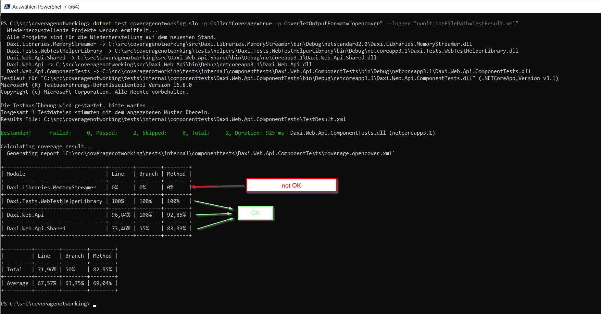

# About

https://github.com/coverlet-coverage/coverlet/issues/1034

For some unknown reason, the coverage is 0 % for my library project `Daxi.Libraries.MemoryStreamer` even though I know it IS hit by the tests.

## Calculating coverage

I am creating the coverage with following command:
```
dotnet test coveragenotworking.sln -p:CollectCoverage=true -p:CoverletOutputFormat="opencover" --logger:"nunit;LogFilePath=TestResult.xml"
```

The output looks like this then:



The controllers of the API are using the net standard library project `Daxi.Libraries.MemoryStreamer`. That library is part of the solution. Also the PDB file for the library exists. Still the coverage of that library is 0 %. Why? When I debug the tests I see that the library code is reached. Also the controllers line that is accessing the library is marked as `covered`.